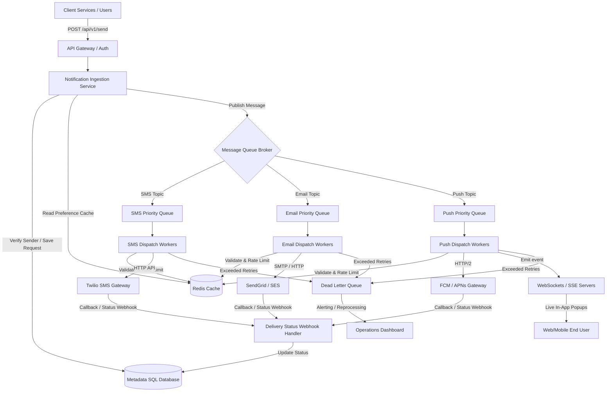

# Notification System Design

This document details the production-grade system architecture and design considerations for a scalable, highly available, and reliable notification system.

---

## 1. System Goals & Requirements

### Functional Requirements
*   **Multi-Channel Support**: Support delivery of notifications via multiple channels including **Push (In-App/Mobile)**, **SMS**, and **Email**.
*   **Real-time Delivery**: Guarantee low latency for critical alerts (e.g., OTPs, transactional updates).
*   **User Preferences**: Allow users to opt in/out of specific channels, set quiet hours, and select preferred notification frequencies.
*   **Status Tracking**: Track the lifecycle of each notification: `Created` $\rightarrow$ `Queued` $\rightarrow$ `Sent` $\rightarrow$ `Delivered` $\rightarrow$ `Failed` $\rightarrow$ `Read`.

### Non-Functional Requirements
*   **Scalability**: Ingest and process millions of notifications per day, handling high traffic bursts gracefully (e.g., marketing campaigns).
*   **High Availability**: The ingestion API must be highly available to prevent blocking upstream client microservices.
*   **At-least-once Delivery**: Guarantee that critical notifications are never lost, even if downstream providers experience outages.
*   **Rate Limiting**: Protect users from spam and prevent overloading downstream third-party email/SMS provider budgets.

---

## 2. High-Level System Architecture

A decoupled, queue-driven architecture is critical to ensure that system failures or third-party API slowness do not cause cascading failures upstream.

### Components Description

1.  **API Gateway / Auth**: Routes requests from microservices (e.g., checkout, security, marketing), handles authentication, and performs basic request rate limiting.
2.  **Notification Ingestion Service**: A lightweight, stateless service whose sole job is to validate incoming payloads, write a record to the main database with a `Created` status, query Redis to inspect user notification settings (ignoring notifications if opted out), and push the job onto the message broker.
3.  **Message Queue Broker (Kafka / RabbitMQ)**: Decouples message ingestion from message delivery. Using separate queues (topics) per channel (SMS, Email, Push) prevents slow delivery in one channel (e.g. slow email servers) from blocking critical alerts in another (e.g. OTP SMS).
4.  **Dispatch Workers**: Consumer microservices that pull messages from their respective queues. They construct the final template content, resolve international phone numbers or email structures, check final rate limits, and make the HTTP call to external delivery providers.
5.  **Redis Cache**: Used to cache user profile settings, notification preferences (to avoid hitting the database for every single message), and rate-limiting bucket counters.
6.  **Core Database (PostgreSQL)**: Stores permanent records of sent notifications, transaction IDs, statuses, and delivery logs.
7.  **External Delivery Providers**: Services like Twilio (SMS), SendGrid/AWS SES (Email), and Firebase Cloud Messaging (FCM) / Apple Push Notification service (APNs) for push delivery.

---

## 3. Database Schema

For tracking notifications, we design a relational schema optimized for write performance and indexing on status and user IDs.

### Table: `users`
| Column Name | Type | Constraints | Description |
| :--- | :--- | :--- | :--- |
| `id` | UUID | Primary Key | Unique user identifier |
| `email` | VARCHAR(255) | Unique | User's email address |
| `phone` | VARCHAR(20) | Unique | User's phone number in E.164 format |
| `preferences` | JSONB | - | Channel configuration (e.g., `{"email": true, "sms": false, "inApp": true}`) |

### Table: `notifications`
| Column Name | Type | Constraints | Description |
| :--- | :--- | :--- | :--- |
| `id` | UUID | Primary Key | Unique notification tracking ID |
| `user_id` | UUID | Foreign Key -> `users.id` | Recipient ID |
| `title` | VARCHAR(150) | Not Null | Short title / header |
| `message` | TEXT | Not Null | Detailed text payload |
| `channel` | VARCHAR(20) | Not Null | `sms`, `email`, or `in_app` |
| `status` | VARCHAR(20) | Not Null | `created`, `queued`, `sent`, `delivered`, `failed`, `read` |
| `idempotency_key`| VARCHAR(255) | Unique | Prevents duplicate delivery of the same event |
| `created_at` | TIMESTAMP | Default NOW() | Time request was received |
| `updated_at` | TIMESTAMP | Default NOW() | Last time status changed |

---

## 4. Key Engineering Challenges & Solutions

### A. At-Least-Once Delivery & Deduplication
To ensure critical alerts are not lost, workers acknowledge messages from the queue *only after* they receive a success response from the provider or write to the Dead Letter Queue.
To handle potential duplicates (from network retries or consumer restarts):
*   **Idempotency Keys**: Upstream services generate a unique UUID for each event (e.g., `order_10492_confirm`). The ingestion service uses a unique constraint on `idempotency_key` in the database. If a request with the same key arrives, the system rejects it as a duplicate or returns the cached status immediately.

### B. Rate Limiting and Throttling
We implement rate limiting at two levels:
1.  **Ingestion Rate Limiting**: Token-bucket algorithm via Redis limits the number of requests a microservice can make.
2.  **Recipient Rate Limiting**: Prevent user fatigue. For example, if a user receives more than 5 promotional emails in an hour, block/delay subsequent ones. This is checked by workers against Redis counters before sending.

### C. Error Handling, Retries & DLQ
When an external provider fails:
1.  **Transient Errors** (e.g., 503 Service Unavailable, timeout): The worker retries sending the message using **Exponential Backoff with Jitter** to prevent stampeding the downstream provider.
    $$\text{Backoff Time} = 2^{\text{attempt}} \times \text{Base Delay} + \text{Random Jitter}$$
2.  **Max Retries Exceeded / Non-Transient Errors** (e.g., 400 Bad Request, invalid phone number): The worker routes the message to the **Dead Letter Queue (DLQ)**. Operations staff can monitor the DLQ, inspect failed payloads, patch issues, and trigger redelivery.

### D. Real-Time Client Connections
For displaying In-App notifications inside the web client instantly, we choose:
*   **Server-Sent Events (SSE)**: A unidirectional HTTP protocol that allows the server to stream live events to browsers. It is natively supported by browsers, automatically handles reconnection, and works over simple HTTP/1.1 or HTTP/2 without requiring custom WebSocket handshake configurations. It is ideal for live dashboards.
